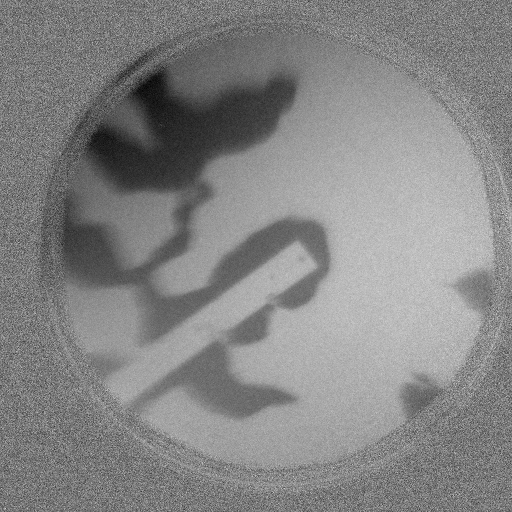
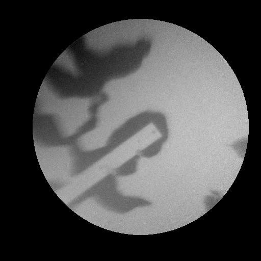
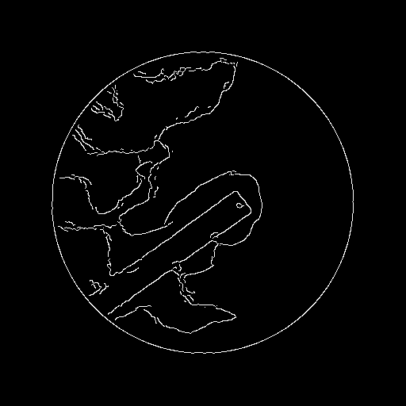

Matlab code for domain wall extraction from magnetic contrast images obtained from X-ray photoemission electron microscopy
--------------------------------------------------------------------------------------------------------------------------
The code extracts the domain walls of magnetic domains from an image sequence acquired from X-ray photoemission electron microscopy. The code does the following function described in the videos shown below
1. Load XPEEM image sequence after drift correction 
 
  
2. Clear unwanted area 
 

3. Finally, Extracts domain walls from the individual images from the sequence 
 

 
<u>How to use the code:</u> 
 
Simply copy paste the code in the Matlab command window, edit as needed and run.
Description of the code, with example is available as pdf 
 

Codes written by Jaianth Vijayakumar 
 

XPEEM images shown here were acquired by Jaianth Vijayakumar, Carlos A.F. Vaz 
 

Samples prepared by Jaianth Vijayakumar, Michael Horisberger 
 
Supervisors for this project : Carlos A.F. Vaz and Frithjof Nolting 
 
THE XPEEM IMAGES SHOWN HERE WERE MEASURED AT SIM BEAMLINE at the SWISS LIGHT SOURCE,
PAUL SCHERRER INSTITUT, SWITZERLAND 
